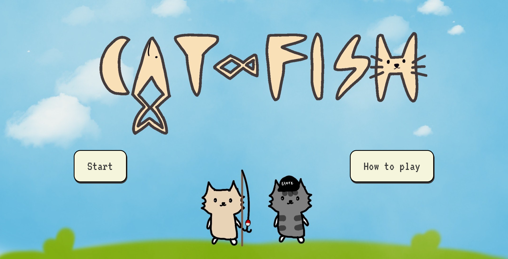
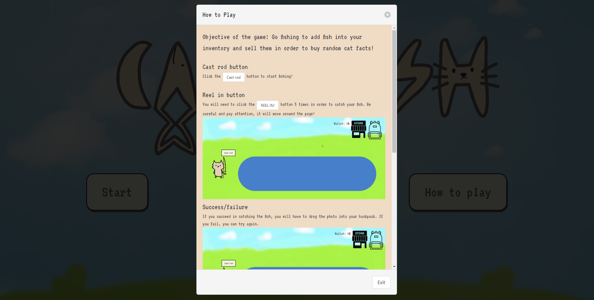
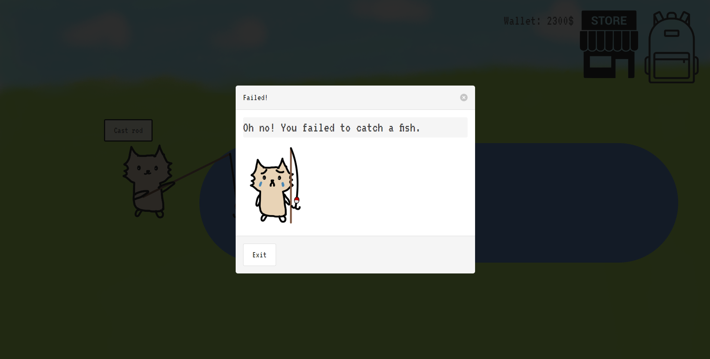
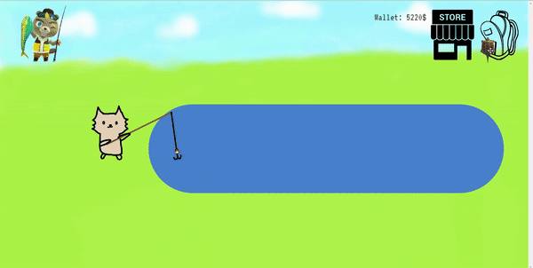
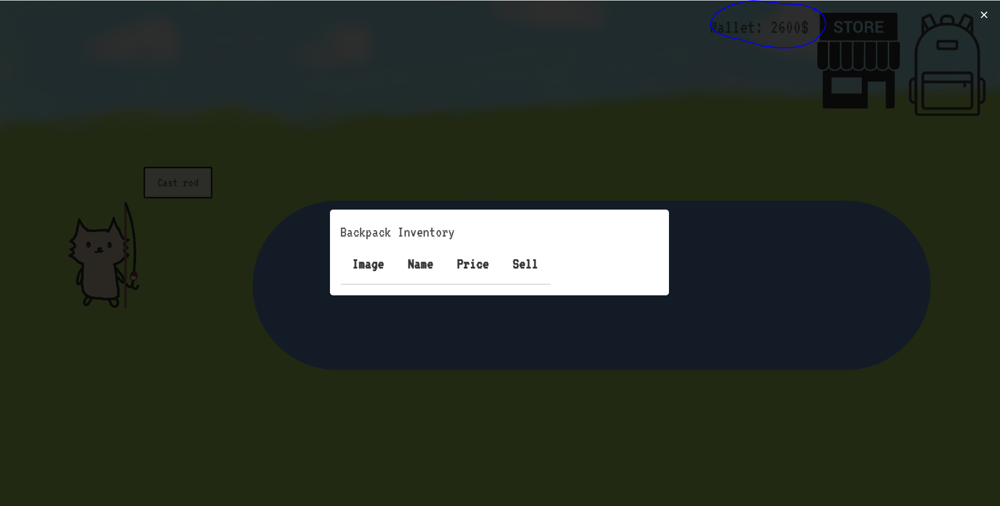
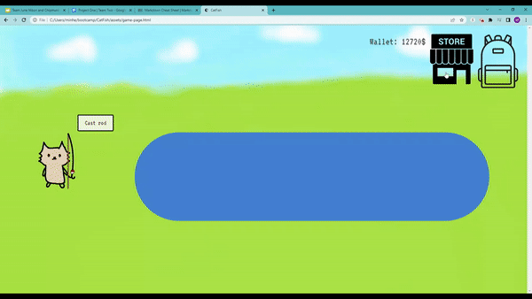

# CatFish

## Description

CatFish is a game that allows users to catch fish to sell, in order to buy random cat facts. This project was built for entertainment purposes, with the inspiration of a creator that has an interest in Animal Crossing and love for cats. We learned to incorporate HTML, CSS, JavaScript, and third party APIs to create one website.

Link to deployed site: (https://kaylaasana.github.io/CatFish/)

## Table of Contents

- [Usage](#usage)
- [Technologies Used](#technologies-used)
- [Credits](#credits)

## Usage

Click the "start" button to jump right into the game or the "how to play" button to read!

 
Click "cast rod" to start fishing and click the "reel in" button 4 times within a time interval. If successful, a modal will pop up with the random fish you got, as pictured above.

If failed, the failure modal with a sad cat will pop up.

 
Dragging your fish to the backpack will open it and drop the fish into your inventory.

'
 
In this example, the turtle in the normal inventory is 5000 while if you sell to CJ, you can sell it at a higher price for 7500. CJ will pop up every once in a while after you fish.

Once sold, the fish will disappear from the inventory and the price will be added to your wallet.

 
As you buy cat facts, worth $5000, the money will be subtracted from your wallet. If you try to buy a fact when you don't have enough money, you will be met with an angry store cat sales-animal.

## Technologies Used

* [Bulma](https://bulma.io/)
* [Google Fonts VT323](https://fonts.google.com/specimen/VT323?category=Handwriting,Monospace&sort=popularity)
* [interact.js](https://interactjs.io/)
* HTML
* CSS
* JavaScript

### APIs:

* [Animal Crossing Fish API](https://acnhapi.com/v1/fish/)

* [MeowFacts API](https://meowfacts.herokuapp.com/)

## Credits

### Kayla Datte
- [GitHub](https://github.com/kaylaasana)
- [LinkedIn](https://www.linkedin.com/in/kayladatte/)

### Minhee Chung
- [Github](https://github.com/mchung03)
- [LinkedIn](https://www.linkedin.com/in/minhee-chung/)

### June Moon
- [Github](https://github.com/moonjunsain)
- [Linkedin](https://www.linkedin.com/in/june-moon-940538280/)

Images:

* [Open backpack](https://clipartcraft.com/startdownload.html)
* [Closed backpack](https://clipground.com/backpack-icon-png.html)
* [Store](http://www.onlinewebfonts.com/icon)
* [CJ image](https://nookipedia.com/wiki/C.J./Gallery#/media/File:C.J._NH.png)
* Icon Illustration: Ari Kim(https://www.instagram.com/aryxkim/)
* Character/title design: Minhee Chung