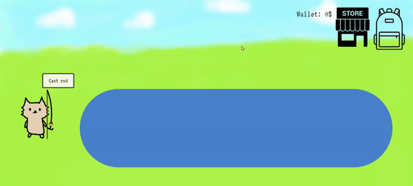
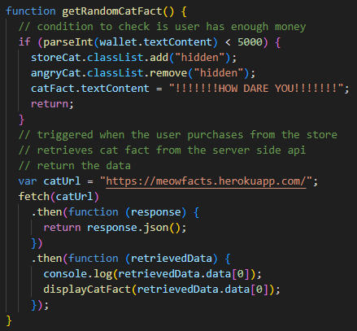

# CatFish

## Description

CatFish is a game that allows users to catch fish to sell, in order to buy random cat facts. This project was built for entertainment purposes, with the inspiration of a creator that has an interest in Animal Crossing and love for cats. We learned to incorporate HTML, CSS, JavaScript, and third party APIs to create one website.

Link to deployed site: (https://kaylaasana.github.io/CatFish/)

Presentation link: (https://docs.google.com/presentation/d/1tbUX_hbqUkRPn2RHLv-9V4_ODjiwgccQ2HX7UU3FyM0/edit?usp=sharing)

## Table of Contents

- [Technologies Used](#technologies-used)
- [User Stories](#user-stories)
- [API User Stories](#api-user-stories)
- [Learning Objectives](#learning-objectives)
- [Authors](#authors)
- [Credits](#credits)

## Technologies Used

* [Bulma](https://bulma.io/) (More info below!)
* [Google Fonts VT323](https://fonts.google.com/specimen/VT323?category=Handwriting,Monospace&sort=popularity)
* [interact.js](https://interactjs.io/)
* HTML
* CSS
* JavaScript

### APIs:

* [Animal Crossing Fish API](https://acnhapi.com/v1/fish/)

* [MeowFacts API](https://meowfacts.herokuapp.com/)

### [Bulma](https://bulma.io/)

Bulma is a CSS library that helps you style your HTML code. To get started, insert this line of code into the head of your HTML.

`<link rel="stylesheet" href="https://cdn.jsdelivr.net/npm/bulma@0.9.4/css/bulma.min.css">`

* [Modal documentation](https://bulma.io/documentation/components/modal/)
    * The HTML template provided with the documentation for the "is-active" modifier to activate the modal were used to create the success modal, failure modal, store, and inventory.
* [Button documentation](https://bulma.io/documentation/elements/button/)
    * The button class with the size modifiers were used to style the buttons on the homepage, exit buttons on the modals, and the buy cat fact button.
* Resizing at different viewports

## User Stories

Click the "start" button to jump right into the game or the "how to play" button to read!

 
Click "cast rod" to start fishing and click the "reel in" button 4 times within a time interval. If successful, a modal will pop up with the random fish you got, as pictured above.

If failed, the failure modal with a sad cat will pop up.

 
Dragging your fish to the backpack will open it and drop the fish into your inventory.

'
 
In this example, the turtle in the normal inventory is 5000 while if you sell to CJ, you can sell it at a higher price for 7500. CJ will pop up every once in a while after you fish.

Once sold, the fish will disappear from the inventory and the price will be added to your wallet (this price is adding on from the failure modal).

 
As you buy cat facts, worth $5000, the money will be subtracted from your wallet. If you try to buy a fact when you don't have enough money, you will be met with an angry store cat sales-animal.

## API User Stories

The fetch request generates a random fish from the Animal Crossing API and stores it into the global inventory object.

The fetch request generates a random cat fact to display from the MeowFact API.

## Learning Objectives

1. Working with fellow programmers helped me learn how to communicate to explain my ideas and thoughts, as well as expand and build off each other.
2. It also forced me to work with git branching, which created many merge conflicts. It was a new challenge and definitely helped me understand the intricacies of merge conflicts and the process for resolving them.
3. Learning how to read documentation for varying apis, frameworks, and libraries. Understanding various API documentation was a challenge that I look forward to expanding on as I dive into even more available APIs in the future.
4. I learned how to use some aspects of CSS that were unfamiliar to me like the z-index for the background image in the homepage and gamepage. 
Also found it helpful to know that it can have a negative value, which was helpful in our gamepage code.
5. I learned to use traversal for multiple features on the page, such as retrieving random data to append to a row in the inventory.

## Authors

### Kayla Datte
- [GitHub](https://github.com/kaylaasana)
- [LinkedIn](https://www.linkedin.com/in/kayladatte/)

### Minhee Chung
- [Github](https://github.com/mchung03)
- [LinkedIn](https://www.linkedin.com/in/minhee-chung/)

### June Moon
- [Github](https://github.com/moonjunsain)
- [Linkedin](https://www.linkedin.com/in/june-moon-940538280/)

## Credits

Images:

* [Open backpack](https://clipartcraft.com/startdownload.html)
* [Closed backpack](https://clipground.com/backpack-icon-png.html)
* [Store](http://www.onlinewebfonts.com/icon)
* [CJ image](https://nookipedia.com/wiki/C.J./Gallery#/media/File:C.J._NH.png)
* Icon Illustration: Ari Kim(https://www.instagram.com/aryxkim/)
* Character/title/background design: Minhee Chung